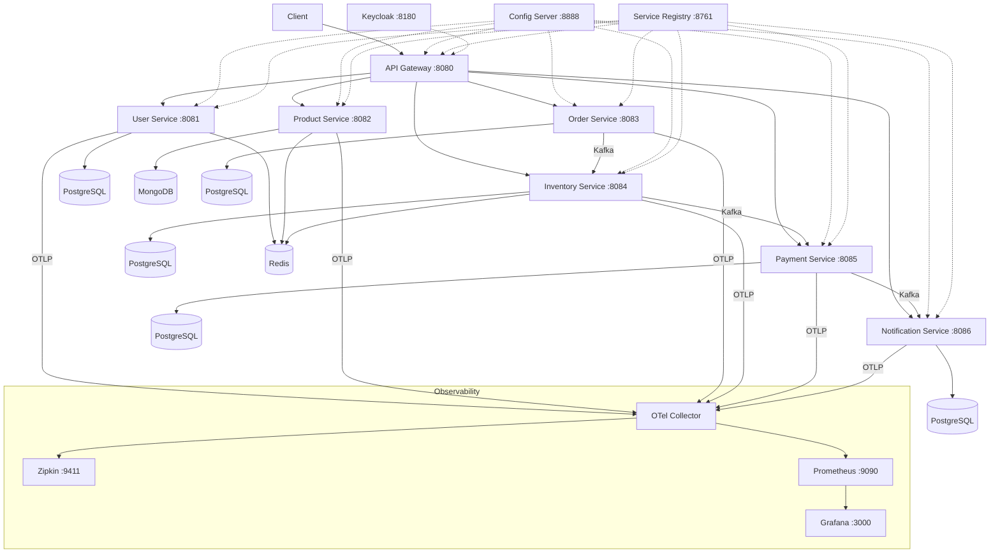

# E-Commerce Microservices Platform

A production-grade, enterprise-ready microservices platform built with **Java 21**, **Spring Boot 3.4**, and **Spring Cloud 2024.0**. Designed as a comprehensive reference architecture demonstrating real-world patterns and best practices.

## Architecture



## Modules

| Module | Port | Description |
|--------|------|-------------|
| `common-lib` | — | Shared DTOs, events, exceptions, security utilities, cache config |
| `config-server` | 8888 | Centralized configuration (Spring Cloud Config) |
| `service-registry` | 8761 | Service discovery (Eureka) |
| `api-gateway` | 8080 | API Gateway (Spring Cloud Gateway, WebFlux) |
| `user-service` | 8081 | User registration, authentication, profiles |
| `product-service` | 8082 | Product catalog, categories (MongoDB) |
| `order-service` | 8083 | Order management, saga orchestrator |
| `inventory-service` | 8084 | Stock management, reservations |
| `payment-service` | 8085 | Payment processing (Strategy pattern) |
| `notification-service` | 8086 | Notifications, CQRS saga view (Kafka Streams) |

## Design Patterns

| Pattern | Where | Purpose |
|---------|-------|---------|
| **Choreography Saga** | Order creation flow | Decentralized event-driven coordination |
| **Orchestration Saga** | Return/refund flow | Centralized state machine coordination |
| **Strategy** | Payment, Notification | Pluggable algorithms (credit card/wallet, email/SMS) |
| **Factory** | SagaStepFactory, PaymentStrategyFactory | Centralized object creation |
| **Outbox** | Order Service | Atomic event publishing with DB transactions |
| **CQRS** | Notification Service | Kafka Streams read model for saga status |
| **Circuit Breaker** | Order → Product/Inventory calls | Resilience against downstream failures |
| **API Gateway** | api-gateway | Single entry point, JWT auth, routing |
| **Service Discovery** | Eureka | Dynamic service location resolution |

## Tech Stack

- **Runtime:** Java 21, Spring Boot 3.4.2, Spring Cloud 2024.0.1
- **Databases:** PostgreSQL 16, MongoDB 7.0, Redis 7.4
- **Messaging:** Apache Kafka (Confluent 7.7), Kafka Streams
- **Security:** Keycloak 26.0 (OAuth2/OIDC), JWT
- **Resilience:** Resilience4j (Circuit Breaker, Retry, Bulkhead)
- **Observability:** OpenTelemetry, Zipkin, Prometheus, Grafana
- **Caching:** Redis with Spring Cache (`@Cacheable`/`@CacheEvict`)
- **Containerization:** Docker, Kubernetes
- **CI/CD:** GitHub Actions
- **Build:** Maven multi-module

## Quick Start

### Prerequisites
- Java 21+
- Maven 3.9+
- Docker & Docker Compose

### Build
```bash
mvn clean install -DskipTests
```

### Option A: Run with Docker Compose (all-in-one)
```bash
cd docker
docker-compose up -d
```

### Option B: Run Locally (services on host, infra in Docker)

**1. Start infrastructure only:**
```bash
cd docker
docker-compose up -d zookeeper kafka redis zipkin otel-collector prometheus grafana keycloak user-db product-db order-db inventory-db payment-db notification-db
```

**2. Start services (in order, each in a separate terminal):**
```bash
# Wait ~10s between config-server, service-registry, and the rest
java -jar config-server/target/config-server-1.0.0.jar
java -jar service-registry/target/service-registry-1.0.0.jar
java -jar api-gateway/target/api-gateway-1.0.0.jar --spring.profiles.active=local
java -jar user-service/target/user-service-1.0.0.jar --spring.profiles.active=local
java -jar product-service/target/product-service-1.0.0.jar --spring.profiles.active=local
java -jar order-service/target/order-service-1.0.0.jar --spring.profiles.active=local
java -jar inventory-service/target/inventory-service-1.0.0.jar --spring.profiles.active=local
java -jar payment-service/target/payment-service-1.0.0.jar --spring.profiles.active=local
java -jar notification-service/target/notification-service-1.0.0.jar --spring.profiles.active=local
```

The `local` profile overrides Docker hostnames (kafka, user-db, etc.) with `localhost` equivalents.

### Verify
- API Gateway: http://localhost:8080
- Eureka Dashboard: http://localhost:8761
- Zipkin: http://localhost:9411
- Grafana: http://localhost:3000 (admin/admin)
- Keycloak: http://localhost:8180 (admin/admin)
- Swagger UI (per service): http://localhost:{port}/swagger-ui.html

## Project Structure

```
Microservices/
├── common-lib/              # Shared library (DTOs, events, security, cache)
├── config-server/           # Spring Cloud Config Server
├── service-registry/        # Eureka Service Registry
├── api-gateway/             # Spring Cloud Gateway (WebFlux)
├── user-service/            # User management + auth
├── product-service/         # Product catalog (MongoDB)
├── order-service/           # Orders + saga orchestrator
├── inventory-service/       # Stock management
├── payment-service/         # Payments (Strategy pattern)
├── notification-service/    # Notifications + CQRS view
├── docker/                  # Docker Compose + infra configs
│   ├── docker-compose.yml
│   ├── keycloak/            # Realm export
│   ├── otel/                # OTel Collector config
│   └── prometheus/          # Prometheus config
├── k8s/                     # Kubernetes manifests
│   ├── namespace/
│   ├── infrastructure/      # Postgres, Mongo, Kafka, Redis, Observability
│   └── services/            # Per-service Deployment + Service + HPA
├── .github/workflows/       # CI/CD pipelines
├── docs/                    # Architecture docs, saga flows, interview guide
└── pom.xml                  # Parent POM
```

## Saga Flows

### Order Creation (Choreography)
```
Order Service → [ORDER_CREATED] → Inventory Service → [INVENTORY_RESERVED] → Payment Service → [PAYMENT_COMPLETED] → Notification Service
```

### Order Return (Orchestration)
```
ReturnSagaOrchestrator → [INITIATE_REFUND] → Payment Service → [REFUND_COMPLETED] → [RESTORE_INVENTORY] → Inventory Service → [INVENTORY_RESTORED] → [SEND_NOTIFICATION] → Notification Service → [COMPLETED]
```

See [docs/saga-flows.md](docs/saga-flows.md) for detailed sequence diagrams.

## Documentation

- [Architecture Decisions](docs/architecture.md) — ADRs for key design choices
- [Saga Flows](docs/saga-flows.md) — Detailed choreography & orchestration flow diagrams
- [Interview Guide](docs/interview-guide.md) — Pattern explanations with 2-minute answers

## Kubernetes Deployment

```bash
# Create namespace
kubectl apply -f k8s/namespace/

# Deploy infrastructure
kubectl apply -f k8s/infrastructure/

# Deploy services
kubectl apply -f k8s/services/config-server/
kubectl apply -f k8s/services/service-registry/
# Wait for config-server and registry to be ready, then:
kubectl apply -f k8s/services/api-gateway/
kubectl apply -f k8s/services/user-service/
kubectl apply -f k8s/services/product-service/
kubectl apply -f k8s/services/order-service/
kubectl apply -f k8s/services/inventory-service/
kubectl apply -f k8s/services/payment-service/
kubectl apply -f k8s/services/notification-service/
```
